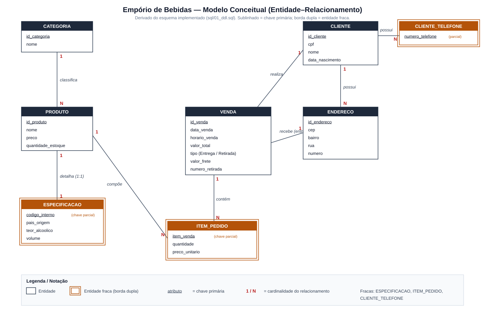

# Banco de Dados - Empório de Bebidas

Projeto desenvolvido para a disciplina de Banco de Dados da Universidade Federal do Agreste de Pernambuco (UFAPE).

## Integrantes do Grupo

- Rafael Carvalho Rodrigues
- Douglas Henrique Soares Salviano Da Silva
- Misael Salvador Marques
- Pedro Nunes Valeriano Duarte

**Universidade:** Universidade Federal do Agreste de Pernambuco (UFAPE)  
**Curso:** Bacharelado em Ciência da Computação  
**Disciplina:** Banco de Dados  
**Professora:** Priscilla Kelly Machado Vieira Azevedo

---

## Contexto do Projeto

Este projeto consiste na modelagem e implementação de um banco de dados relacional para o gerenciamento de um Empório de Bebidas / Adega.

O sistema contempla o cadastro e gerenciamento de:

- Clientes;
- Telefones dos clientes;
- Endereços;
- Categorias de produtos;
- Produtos;
- Especificações dos produtos;
- Vendas;
- Itens de cada venda.

O sistema também diferencia as vendas realizadas nas modalidades de **Entrega** e **Retirada**, permitindo o armazenamento do valor do frete para entregas e do número de retirada para pedidos retirados no balcão.

---

## Tecnologias Utilizadas

- **SGBD:** PostgreSQL 16
- **Container:** Docker
- **Imagem Docker:** `postgres:16-alpine`
- **Docker Compose:** versão 3.8
- **Linguagem utilizada para definição e povoamento:** SQL

---

## Configuração do Banco de Dados

O banco é executado em um container Docker.

| Configuração | Valor |
|---|---|
| SGBD | PostgreSQL 16 |
| Banco de dados | `emporio_bebidas` |
| Usuário | `admin_adega` |
| Senha | `admin_senha_123` |
| Porta do host | `5433` |
| Porta interna | `5432` |
| Container | `bd_adega_emporio` |

A porta `5433` do computador é direcionada para a porta padrão
`5432` do PostgreSQL dentro do container.

### Portas da Aplicação

A aplicação web (backend + frontend) é construída em **Next.js**, onde o backend (rotas de API em `src/app/api`) e o frontend rodam no mesmo processo.

| Serviço | Porta (host) | Porta (container) |
|---|---|---|
| Banco de dados (PostgreSQL) | `5433` | `5432` |
| Backend + Frontend (Next.js) | `3000` | `3000` |

Após executar `docker compose up`, a aplicação fica acessível em **http://localhost:3000** e o banco em **localhost:5433**.

---

## Estrutura do Projeto

```text
Banco_dados_EmporioBebidas/
├── LICENSE
├── README.md
├── Sistema
│   ├── Dockerfile
│   ├── jsconfig.json
│   ├── package-lock.json
│   ├── package.json
│   └── src
│       ├── app
│       │   ├── api
│       │   │   ├── clientes
│       │   │   │   └── route.js
│       │   │   ├── enderecos
│       │   │   │   └── route.js
│       │   │   ├── produtos
│       │   │   │   └── route.js
│       │   │   ├── vendas
│       │   │   │   └── route.js
│       │   │   └── views
│       │   │       └── route.js
│       │   ├── layout.js
│       │   ├── page.js
│       │   ├── clientes
│       │   │   └── page.js
│       │   ├── produtos
│       │   │   └── page.js
│       │   ├── vendas
│       │   │   └── page.js
│       │   └── relatorios
│       │       └── page.js
│       └── lib
│           └── db.js
├── docker-compose.yml
├── docs
│   ├── Diagrama_lógico.png
│   ├── Modelo_Conceitual.svg
│   └── Dicionário de Dados.pdf
└── sql
    ├── 01_ddl.sql
    ├── 02_dml.sql
    ├── 03_views.sql
    └── 04_triggers.sql
```

### `01_ddl.sql`

Responsável pela criação das tabelas, chaves primárias, chaves estrangeiras, restrições e demais estruturas do banco de dados.

### `02_dml.sql`

Responsável pelo povoamento do banco de dados com os dados utilizados nos testes e consultas.

### `03_views.sql`

Responsável por gerar as views do banco de dados.

### `04_triggers.sql`

Responsável por criar o **gatilho (trigger) de controle automático de estoque** e a função `plpgsql` associada. Consulte a seção [Gatilho (Trigger) de Controle de Estoque](#gatilho-trigger-de-controle-de-estoque) para detalhes da regra de negócio e de como testá-lo.

## Execução com Docker

Para executar o projeto, é necessário possuir o Docker e o Docker Compose instalados.

Na pasta raiz do projeto, execute:

```bash
docker-compose up -d
```

Para verificar o estado do container:

```bash
docker-compose ps
```

Para acessar o PostgreSQL diretamente pelo container:

```bash
docker exec -it bd_adega_emporio psql -U admin_adega -d emporio_bebidas
```

Para parar o ambiente:

```bash
docker-compose down
```

Caso seja necessário recriar o banco completamente do zero, incluindo o volume de dados:

```bash
docker-compose down -v
docker-compose up -d
```

Os scripts presentes em `sql/` são executados automaticamente durante a inicialização de um banco novo.

## Metodologia de Povoamento

Foi utilizada uma estratégia de **geração de dados sintéticos controlados**, com o objetivo de produzir um volume mínimo de registros que também apresentasse diversidade suficiente para a realização das consultas propostas na atividade. Os registros foram inseridos por meio de comandos `INSERT` no arquivo `02_dml.sql`, respeitando as chaves primárias, chaves estrangeiras e demais restrições definidas no DDL.

O povoamento atual contém:

| Tabela | Quantidade |
|---|---:|
| `categoria` | 15 |
| `produto` | 50 |
| `especificacao` | 50 |
| `cliente` | 50 |
| `cliente_telefone` | 18 |
| `endereco` | 50 |
| `venda` | 50 |
| `item_pedido` | 200 |

As vendas possuem diferentes produtos e quantidades, permitindo realizar consultas sobre produtos mais vendidos, valores de vendas, clientes, categorias e outras informações relacionadas ao funcionamento do empório.

Cada venda possui quatro itens de pedido no povoamento utilizado.

Os valores totais das vendas foram calculados a partir da soma dos valores dos respectivos itens:

```text
valor_total = Σ (quantidade × preco_unitario)
```

Obs.: valor_frete não entra no valor_total.

Também foram utilizadas as duas modalidades de venda:

- **Entrega:** possui valor de frete;
- **Retirada:** possui número de retirada.

A carga dos dados é realizada automaticamente pelo PostgreSQL durante a inicialização do container Docker, por meio do arquivo `02_dml.sql`.

## Modelo de Dados e Normalização

O banco foi desenvolvido a partir do modelo conceitual elaborado na etapa anterior da atividade e posteriormente transformado em um modelo lógico relacional.

O modelo foi estruturado de forma a atender, no mínimo, à **Segunda Forma Normal (2FN)**. As relações possuem atributos atômicos e não apresentam dependências parciais em relação às chaves primárias compostas.

Na tabela `item_pedido`, por exemplo, a chave primária é composta por:

```text
(id_venda, item_venda)
```

Os atributos `id_produto`, `quantidade` e `preco_unitario` dependem da identificação completa do item.

A tabela `cliente_telefone` também utiliza uma chave composta:

```text
(id_cliente, numero_telefone)
```

representando o atributo multivalorado de telefone associado ao cliente.

## Esquema Conceitual

O esquema conceitual do banco (modelo Entidade–Relacionamento) está disponível em
[`docs/Modelo_Conceitual.svg`](docs/Modelo_Conceitual.svg).



O diagrama representa as entidades e seus relacionamentos:

- **Entidades fortes:** `CATEGORIA`, `PRODUTO`, `CLIENTE`, `ENDERECO`, `VENDA`.
- **Entidades fracas:** `ESPECIFICACAO` (dependente de `PRODUTO`, relação 1:1), `CLIENTE_TELEFONE`
  (atributo multivalorado de `CLIENTE`) e `ITEM_PEDIDO` (dependente de `VENDA`).
- **Relacionamentos e cardinalidades:** uma `CATEGORIA` classifica vários `PRODUTO`s (1:N);
  um `CLIENTE` possui vários `ENDERECO`s e vários telefones (1:N) e realiza várias `VENDA`s (1:N);
  uma `VENDA` contém vários `ITEM_PEDIDO`s (1:N) e cada item compõe-se de um `PRODUTO` (N:1);
  uma `VENDA` do tipo *Entrega* está associada a um `ENDERECO`.

> O modelo lógico correspondente encontra-se em [`docs/Diagrama_lógico.png`](docs/Diagrama_lógico.png).

## Dicionário de Dados

O dicionário de dados do projeto apresenta a descrição das tabelas, atributos, tipos de dados, chaves, restrições e demais informações referentes à estrutura do banco.

O documento está disponível no diretório de documentação do projeto.

## Integridade e Restrições

Foram utilizadas restrições de integridade para garantir a consistência dos dados, incluindo:

- Chaves primárias (`PRIMARY KEY`);
- Chaves estrangeiras (`FOREIGN KEY`);
- Valores obrigatórios (`NOT NULL`);
- Valores únicos (`UNIQUE`);
- Restrições de domínio (`CHECK`);
- Exclusão em cascata (`ON DELETE CASCADE`) em relacionamentos específicos;
- Índices (`CREATE INDEX`) nas chaves estrangeiras que não são cobertas por `PRIMARY KEY` ou `UNIQUE`.

Entre as regras implementadas está a diferenciação entre vendas de **Entrega** e **Retirada**, garantindo que os atributos específicos de cada modalidade sejam preenchidos de acordo com o tipo da venda.

## Validação do Povoamento

Foram realizadas consultas para verificar a quantidade de registros e a consistência dos dados.

Também foi validado que o `valor_total` de cada venda corresponde à soma dos valores dos seus itens de pedido.

Além disso, o povoamento foi verificado para garantir a existência de quatro itens em cada uma das 50 vendas, totalizando 200 registros em `item_pedido`.

## Gatilho (Trigger) de Controle de Estoque

O banco possui um gatilho que **automatiza a atualização do estoque dos produtos**, definido em
[`sql/04_triggers.sql`](sql/04_triggers.sql).

### Regra de negócio automatizada

Sempre que um produto é vendido, seu estoque deve diminuir automaticamente; e sempre que uma venda é
cancelada ou editada, o estoque deve ser reposto. O gatilho garante essa regra diretamente no banco,
independentemente da aplicação:

| Operação em `item_pedido` | Ação automática no estoque do produto |
|---|---|
| `INSERT` (novo item vendido) | **Debita** `quantidade_estoque` na quantidade vendida |
| `DELETE` (item removido — exclusão/edição de venda) | **Repõe** `quantidade_estoque` |
| `UPDATE` (alteração de item) | Repõe a quantidade antiga e debita a nova |

Além disso, o gatilho **impede a venda sem estoque suficiente**: se a quantidade solicitada for maior
que o estoque disponível, ele lança um erro (`RAISE EXCEPTION`) com uma mensagem clara e a operação é
desfeita (`ROLLBACK`). A API de vendas repassa essa mensagem para a tela.

- **Objeto:** `TRIGGER trg_controla_estoque AFTER INSERT OR UPDATE OR DELETE ON item_pedido`
- **Função:** `fn_controla_estoque()` (linguagem PL/pgSQL)

> **Observação de projeto:** o gatilho é criado **após** o povoamento (`02_dml.sql`). Portanto, as
> vendas do povoamento inicial não passaram por ele. O gatilho controla integralmente as vendas
> **criadas, editadas e excluídas através do sistema**.

### Como testar

**Pela interface (recomendado):**

1. Acesse **Produtos** (`http://localhost:3000/produtos`) e anote o estoque de um produto.
2. Acesse **Vendas** (`http://localhost:3000/vendas`), crie uma venda incluindo esse produto e finalize.
3. Volte em **Produtos** e confira: o estoque foi **reduzido** automaticamente pela quantidade vendida.
4. Em **Vendas**, exclua (ou edite) a venda e confirme que o estoque foi **reposto**.
5. Para ver a validação, tente vender uma quantidade maior que o estoque: a aplicação exibe
   *"Estoque insuficiente para o produto ..."* e a venda não é registrada.

**Pelo SQL (via `psql`):**

```sql
-- estoque antes
SELECT id_produto, nome, quantidade_estoque FROM produto WHERE id_produto = 3;

-- simula um item vendido na venda 1 (o gatilho debita o estoque)
INSERT INTO item_pedido (id_venda, item_venda, id_produto, quantidade, preco_unitario)
VALUES (1, 5, 3, 4, 45.5);

-- estoque depois (reduziu 4 unidades)
SELECT id_produto, nome, quantidade_estoque FROM produto WHERE id_produto = 3;

-- remove o item (o gatilho repõe o estoque)
DELETE FROM item_pedido WHERE id_venda = 1 AND item_venda = 5;
```

## Gerador de Relatórios

A tela de **Relatórios** (`http://localhost:3000/relatorios`) consome as views definidas em
`03_views.sql` e oferece:

- Visualização consolidada das três views (Resumo de Vendas, Produtos Mais Vendidos, Resumo de Clientes);
- Um **gerador de relatórios customizados**, com escolha de colunas, reordenação, busca e filtros
  (por período, tipo de venda, categoria e faixa de valor);
- **Exportação para CSV e PDF** do relatório configurado.

## Correções em Relação à Entrega Anterior

Nesta versão foram corrigidos/complementados os seguintes pontos da entrega anterior:

- **CRUD de Vendas completo:** as vendas passaram a ter também **atualização (UPDATE)** e
  **exclusão (DELETE)**, além de criação e leitura, tanto no backend (`api/vendas/route.js`) quanto
  na interface (`vendas/page.js`).
- **Esquema conceitual:** adicionado o modelo conceitual atualizado em `docs/Modelo_Conceitual.svg`,
  que estava pendente na entrega anterior.
- **Documentação de portas:** o README passou a documentar explicitamente as portas do banco (`5433`),
  do backend e do frontend (`3000`).
- **Controle de estoque:** adicionado o gatilho de baixa/reposição automática de estoque, incluindo
  validação de estoque insuficiente no momento da venda.